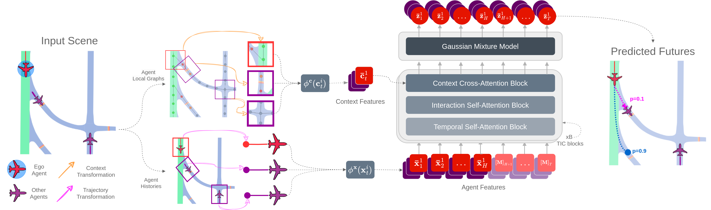

# Amelia-TF

This repository contains the model implementation, as well as the training and evaluation code of our paper:

### Amelia: A Large Dataset and Model for Airport Surface Movement Forecasting [[paper](todo)]

[Ingrid Navarro](https://navars.xyz) *, [Pablo Ortega-Kral](https://paok-2001.github.io) *, [Jay Patrikar](https://www.jaypatrikar.me) *, Haichuan Wang,
Zelin Ye, Jong Hoon Park, [Jean Oh](https://cmubig.github.io/team/jean_oh/) and [Sebastian Scherer](https://theairlab.org/team/sebastian/)

*Equal contribution


<p align="center">
  
</p>

## Overview

**Amelia-TF** is a large transformer-based trajectory forecasting model that aims to characterize relevant **airport surface movement** operations from the [Amelia-48](https://ameliacmu.github.io/amelia-dataset/) dataset.

To do so, our model comprises three main submodules:

1. A **scene representation** module that determines the agents of interest in the scene using a scoring strategy, and encodes per-agent features,
2. A transformer-based **scene encoder**, which hierarchically encodes the temporal, agent-to-agent and agent-to-context relationships within a scene, and;
3. A **trajectory decoder** that models the set of possible futures with associated confidence scores using a Gaussian Mixture Model.

<p align="center">
  
</p>

We explore different scene representation and training experiments for our model varying from **single-airport** to **multi-airport** settings in which we assess our model’s generalization capabilities. In the subsequent sections we provide details on how to reproduce our experiments. For further details, please check out our paper!

## Pre-requisites

### Installation

#### Basic Setup

First, install **Amelia-Scenes**. Here are the [instructions](https://github.com/AmeliaCMU/AmeliaScenes/INSTALL.md).

Then, install **Amelia-TF**: Activate the environment created during the **Amelia-Scenes** setup:

```bash
conda activate amelia
```

Download the GitHub repository and install requirements:

```bash
git clone git@github.com:AmeliaCMU/AmeliaTF.git
cd AmeliaTF
pip install -e .
```

#### Full Setup

If you're interested in using all of our [tools](https://ameliacmu.github.io/amelia-dataset/), you can install our framework through this [script](https://github.com/AmeliaCMU/AmeliaScenes/install.sh).

### Dataset

To run this repository, you first need to download the amelia dataset. Follow the instructions [here](https://github.com/AmeliaCMU/AmeliaScenes/DATASET.md) to download and setup the dataset.

Once downloaded, create a symbolic link into  ```datasets```:

```bash
cd Amelia-TF/datasets
ln -s /path/to/the/amelia/dataset .
```

### Scenario Pre-processing

Once you've downloaded the dataset and installed the required modules. You need to post-process the dataset. Follow the instructions [here](https://github.com/AmeliaCMU/AmeliaScenes/README.md).

### Additional Notes

Our repository's structure is based on this [template](https://github.com/ashleve/lightning-hydra-template), which uses Hydra and Pytorch Lightning. We recommend going through their [README](https://github.com/ashleve/lightning-hydra-template?tab=readme-ov-file#your-superpowers) for further details into the code's functionalities.


## How to use

Activate your amelia environment (**Please make sure to follow the pre-requisites guidelines above above**):

```bash
conda activate amelia
```

### Training a Model

The general format for running a training experiment is:

```bash
cd src
python train.py data=[data_config] model=[model_config] trainer=[trainer_config]
```

where:

- ```[data_config]```, represents a dataset configuration specified under ```/AmeliaTF/configs/data```
- ```[model_config]```, represents a model configuration specified under ```/AmeliaTF/configs/model```
- ```[trainer_config]```, represents the trainer to be used, (e.g., CPU, GPU, DDP, etc), specified under ```/AmeliaTF/configs/trainer```

For example, to train our model on GPU using all of our currently supported airports, you would run:

```bash
cd Amelia-TF
python train.py data=seen-all model=marginal trainer=gpu
```

### Evaluating a Model

If you already have a pre-trained checkpoint you can run evaluation only using ```eval.py``` and following a similar format as above. However, you need to provide the path to the pre-trained weights. For example,

```bash
cd Amelia-TF
python eval.py data=seen-all model=marginal trainer=gpu ckpt_path=/path/to/pretrained/weights.ckpt
```

### Our experiments

We provide the configuration combination to run our experiments, as well as our pre-trained weights.

#### Single-Airport Experiments (Table 5 in our paper)

The model configuration used for all of these experiments was ```marginal.yaml```.

|Airport | Airport ICAO | Data Config  | ADE@20 | FDE@20 | ADE@50 | FDE@50 | Weights |
| :-----: | :-----: | :----------: | :----: | :----: | :----: | :----: | :-----: |
| Boston-Logan Intl. Airport | KBOS | `kbos.yaml` | xy.xy | xy.xy | xy.xy | xy.xy | [kbos]() |
| Ronald Reagan Washington Natl. Airport | KDCA | `kdca.yaml` | xy.xy | xy.xy | xy.xy | xy.xy | [kdca]() |
| Newark Liberty Intl. Airport | KEWR | `kewr.yaml` | xy.xy | xy.xy | xy.xy | xy.xy | [kewr]() |
| John F. Kennedy Intl. Airport | KJFK | `kjfk.yaml` | xy.xy | xy.xy | xy.xy | xy.xy | [kjfk]() |
| Los Angeles Intl. Airport | KLAX | `klax.yaml` | xy.xy | xy.xy | xy.xy | xy.xy | [klax]() |
| Chicago-Midway Intl. Airport | KMDW | `kmdw.yaml` | xy.xy | xy.xy | xy.xy | xy.xy | [kmdw]() |
| Louis Armstrong New Orleans Intl. Airport | KMSY | `kmsy.yaml` | xy.xy | xy.xy | xy.xy | xy.xy | [kmsy]() |
| Seattle-Tacoma Intl. Airport | KSEA | `ksea.yaml` | xy.xy | xy.xy | xy.xy | xy.xy | [ksea]() |
| San Francisco Intl. Airport | KSFO | `ksfo.yaml` | xy.xy | xy.xy | xy.xy | xy.xy | [ksfo]() |
| Ted Stevens Anchorage Intl. Airport | PANC | `panc.yaml` | xy.xy | xy.xy | xy.xy | xy.xy | [panc]() |

<hr>

#### Multi-Airport Experiments (Table 6 in our paper)

The model configuration used for all of these experiments was also `marginal.yaml`.

|Seen Airport(s) | Unseen Airport(s) | Data Config  | Avg. ADE@20 | Avg. FDE@20 | Avg. ADE@50 | Avg. FDE@50 | Weights |
| :-----: | :-----: | :----------: | :----: | :----: | :----: | :----: | :-----: |
| KMDW | KEWR, KBOS, KSFO, KSEA, KDCA, PANC, KLAX, KJFK, KMSY | `seen-1.yaml` | xy.xy | xy.xy | xy.xy | xy.xy | [seen-1]() |
| KMDW, KEWR | KBOS, KSFO, KSEA, KDCA, PANC, KLAX, KJFK, KMSY | `seen-2.yaml` | xy.xy | xy.xy | xy.xy | xy.xy | [seen-2]() |
| KMDW, KEWR, KBOS | KSFO, KSEA, KDCA, PANC, KLAX, KJFK, KMSY | `seen-3.yaml` | xy.xy | xy.xy | xy.xy | xy.xy | [seen-3]() |
| KMDW, KEWR, KBOS, KSFO | KSEA, KDCA, PANC, KLAX, KJFK, KMSY | `seen-4.yaml` | xy.xy | xy.xy | xy.xy | xy.xy | [seen-4]() |
| KMDW, KEWR, KBOS, KSFO, KSEA, KDCA, PANC | KLAX, KJFK, KMSY | `seen-7.yaml` | xy.xy | xy.xy | xy.xy | xy.xy | [seen-7]() |
| KMDW, KEWR, KBOS, KSFO, KSEA, KDCA, PANC, KLAX, KJFK, KMSY | - | `seen-all.yaml` | xy.xy | xy.xy | xy.xy | xy.xy | [seen-all]() |

<hr>

#### Other Experiments

- We trained our models under a **marginal** prediction setting, but we have support for training models on a **joint** prediction setting. To change the prediction paradigm, change the model parameter to `joint`. For example:

```bash
cd Amelia-TF
python train.py data=seen-all model=joint trainer=gpu
```

- Our model can be trained with and without context (maps). To train the trajectory-only model, use either `marginal_traj` or `joint_traj` configurations. For example,

```bash
cd Amelia-TF
python train.py data=seen-all model=marginal_traj trainer=gpu
```

<hr>

### TODO? Implementation Details

For running distributed training on systems with 4090 it may be possible that the NCCL backend runs into a deadlock and causes the code to hang. To prevent this, set the following environment variable before training.

```bash
export NCCL_P2P_DISABLE=1
```

## BibTeX

If you find our work useful in your research, please cite us!

```bibtex
@article{navarro2024amelia,
  title={Amelia: A Large Model and Dataset for Airport Surface
Movement Forecasting},
  author={Navarro, Ingrid and Ortega-Kral, Pablo and Patrikar, Jay, and Haichuan, Wang and Park, Jong Hoon and Oh, Jean and Scherer, Sebastian},
  journal={arXiv preprint arXiv:2309.08889},
  year={2024}
}
```
