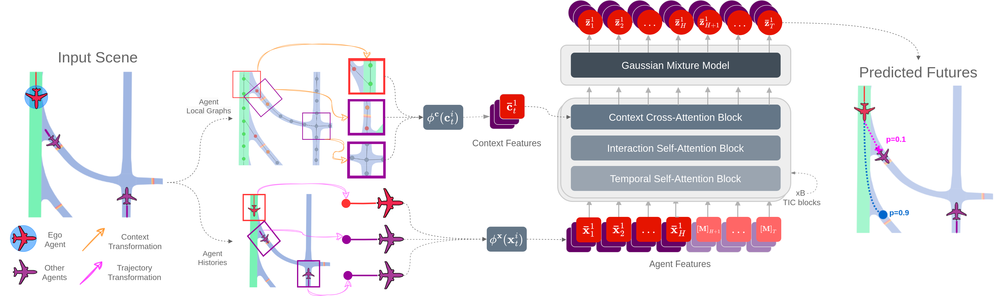

#  AmeliaTF

> **Note:** This repo is undergoing updates. Currently, stable experiments can be run using a multi-GPU setting. (See trainer options in the configuration folders).

> **Note:** To run evaluations on the currently released checkpoints, please use **main_src**.

This repository contains the model implementation, as well as the training and evaluation code of our paper:

***Amelia: A Large Dataset and Model for Airport Surface Movement Forecasting [[paper](https://arxiv.org/pdf/2407.21185)]***

[Ingrid Navarro](https://navars.xyz) *, [Pablo Ortega-Kral](https://paok-2001.github.io) *, [Jay Patrikar](https://www.jaypatrikar.me) *, Haichuan Wang,
Zelin Ye, Jong Hoon Park, [Jean Oh](https://cmubig.github.io/team/jean_oh/) and [Sebastian Scherer](https://theairlab.org/team/sebastian/)

<p align="center">
  
</p>

## Overview

**AmeliaTF** is a large transformer-based trajectory forecasting model that aims to characterize relevant **airport surface movement** operations from the [Amelia-48](https://ameliacmu.github.io/amelia-dataset/) dataset.

To do so, our model comprises three main submodules:

1. A **scene representation** module that determines the agents of interest in the scene using a scoring strategy, and encodes per-agent features,
2. A transformer-based **scene encoder**, which hierarchically encodes the temporal, agent-to-agent and agent-to-context relationships within a scene, and;
3. A **trajectory decoder** that models the set of possible futures with associated confidence scores using a Gaussian Mixture Model.

<p align="center">
  
</p>

We explore different scene representation and training experiments for our model varying from **single-airport** to **multi-airport** settings in which we assess our model’s generalization capabilities. In the subsequent sections we provide details on how to reproduce our experiments. For further details, please check out our paper!

## Pre-requisites

### Dataset

To run this repository, you first need to download the amelia dataset. Follow the instructions [here](https://ameliacmu.github.io/amelia-dataset/) to download the dataset.

Once downloaded, create a symbolic link into  `datasets`:

```bash
cd datasets
ln -s /path/to/amelia .
```

### Installation

Make sure that you have [conda](https://conda.io/projects/conda/en/latest/user-guide/install/index.html) installed.

**Recommended:** Use the  [`install.sh`](https://github.com/AmeliaCMU/AmeliaScenes/blob/main/install.sh) to download and install the Amelia Framework:

```bash
chmod +x install.sh
./install.sh amelia
```

This will create a conda environment named `amelia` and install all dependencies.

Alternatively, refer to [`INSTALL.md`](https://github.com/AmeliaCMU/AmeliaScenes/blob/main/INSTALL.md) for manual installation.

**Note:** AmeliaTF requires the Amelia dataset and AmeliaScenes' dependencies to run, refer to AmeliaScenes' and AmeliaTF's installation.

#### Scenario Pre-processing

Once you've downloaded the dataset and installed the required modules. You need to post-process the dataset. To do so, follow the instructions [here](https://github.com/AmeliaCMU/AmeliaScenes/blob/main/README.md).

#### Additional Notes

Our repository's structure is based on this [template](https://github.com/ashleve/lightning-hydra-template), which uses Hydra and Pytorch Lightning. We recommend going through their [README](https://github.com/ashleve/lightning-hydra-template?tab=readme-ov-file#your-superpowers) for further details into the code's functionalities.

## How to use

Activate your amelia environment (**Please make sure to follow the pre-requisites guidelines above above**):

```bash
conda activate amelia
```

### Training a Model

The general format for running a training experiment is:

```bash
python src/train.py data=<data_config> model=<model_config> trainer=<trainer_config>
```

where:

- `<data_config>`, represents a dataset configuration specified under `./configs/data`
- `<model_config>`, represents a model configuration specified under `./configs/model`
- `<trainer_config>`, represents the trainer to be used, (e.g., CPU, GPU, DDP, etc), specified under `./configs/trainer`

For example, to train our model on GPU using all of our currently supported airports, you would run:

```bash
python src/train.py data=seen-all model=marginal trainer=gpu
```

### Evaluating a Model

If you already have a pre-trained checkpoint you can run evaluation only using `eval.py` and following a similar format as above. However, you need to provide the path to the pre-trained weights. For example,

```bash
python src/eval.py data=seen-all model=marginal trainer=gpu ckpt_path=/path/to/pretrained/weights.ckpt
```

### Our experiments

We provide the configuration combination to run our experiments, as well as our pre-trained weights.

#### Single-Airport Experiments (Table 3 and 4 in our paper)

The model configuration used for all of these experiments was `marginal.yaml`.

| Airport                                   | Airport ICAO | Data Config | ADE@20 | FDE@20 | ADE@50 | FDE@50 | Weights  |
|:-----------------------------------------:|:------------:|:-----------:|:------:| :----: | :----: | :----: | :------: |
| Ted Stevens Anchorage Intl. Airport       |      PANC    | `panc.yaml` |  9.63  | 18.78  | 35.29  |  87.57 | [panc](https://huggingface.co/AmeliaCMU/AmeliaTF-weights-only/tree/main/weights/Single-Airport/panc/checkpoints) |
| Boston-Logan Intl. Airport                |      KBOS    | `kbos.yaml` |  4.97  |  9.49  | 18.01  |  40.14 | [kbos](https://huggingface.co/AmeliaCMU/AmeliaTF-weights-only/tree/main/weights/Single-Airport/kbos/checkpoints) |
| Ronald Reagan Washington Natl. Airport    |      KDCA    | `kdca.yaml` |  5.07  |  9.76  | 16.58  |  40.14 | [kdca](https://huggingface.co/AmeliaCMU/AmeliaTF-weights-only/tree/main/weights/Single-Airport/kdca/checkpoints) |
| Newark Liberty Intl. Airport              |      KEWR    | `kewr.yaml` |  5.91  | 11.41  | 21.05  |  52.40 | [kewr](https://huggingface.co/AmeliaCMU/AmeliaTF-weights-only/tree/main/weights/Single-Airport/kewr/checkpoints) |
| John F. Kennedy Intl. Airport             |      KJFK    | `kjfk.yaml` |  6.18  | 12.25  | 22.58  |  55.51 | [kjfk](https://huggingface.co/AmeliaCMU/AmeliaTF-weights-only/tree/main/weights/Single-Airport/kjfk/checkpoints) |
| Los Angeles Intl. Airport                 |      KLAX    | `klax.yaml` |  9.84  | 19.97  | 35.97  |  89.92 | [klax](https://huggingface.co/AmeliaCMU/AmeliaTF-weights-only/tree/main/weights/Single-Airport/klax/checkpoints) |
| Chicago-Midway Intl. Airport              |      KMDW    | `kmdw.yaml` |  3.67  |  6.71  | 11.99  |  28.04 | [kmdw](https://huggingface.co/AmeliaCMU/AmeliaTF-weights-only/tree/main/weights/Single-Airport/kmdw/checkpoints) |
| Louis Armstrong New Orleans Intl. Airport |      KMSY    | `kmsy.yaml` |  3.35  |  6.37  | 12.36  |  32.27 | [kmsy](https://huggingface.co/AmeliaCMU/AmeliaTF-weights-only/tree/main/weights/Single-Airport/kmsy/checkpoints) |
| Seattle-Tacoma Intl. Airport              |      KSEA    | `ksea.yaml` |  9.76  | 18.35  | 29.94  |  65.82 | [ksea](https://airlab-share-01.andrew.cmu.edu:9000/amelia-processed/Single-Airport/ksea.zip) |
| San Francisco Intl. Airport               |      KSFO    | `ksfo.yaml` |  5.06  |  9.82  | 17.05  |  40.23 | [ksfo](https://airlab-share-01.andrew.cmu.edu:9000/amelia-processed/Single-Airport/ksfo.zip) |

<hr>

#### Multi-Airport Experiments (Table 3 and 4 in our paper)

The model configuration used for all of these experiments was also `marginal.yaml`.

| Seen Airport(s)                                            | Unseen Airport(s)                                    | Data Config     | Avg. ADE@20 | Avg. FDE@20 | Avg. ADE@50 | Avg. FDE@50 | Weights |
| :--------------------------------------------------------: | :--------------------------------------------------: | :-------------: | :---------: | :---------: | :---------: | :---------: | :-----: |
| KMDW                                                       | KEWR, KBOS, KSFO, KSEA, KDCA, PANC, KLAX, KJFK, KMSY | `seen-1.yaml`   |    14.04    |    30.72    |    55.35    |   139.11    | [seen-1](https://huggingface.co/AmeliaCMU/AmeliaTF-weights-only/tree/main/weights/Multi-Airport/seen-1/checkpoints) |
| KMDW, KEWR                                                 | KBOS, KSFO, KSEA, KDCA, PANC, KLAX, KJFK, KMSY       | `seen-2.yaml`   |     8.64    |    18.85    |    36.49    |    94.20    | [seen-2](https://huggingface.co/AmeliaCMU/AmeliaTF-weights-only/tree/main/weights/Multi-Airport/seen-2/checkpoints) |
| KMDW, KEWR, KBOS                                           | KSFO, KSEA, KDCA, PANC, KLAX, KJFK, KMSY             | `seen-3.yaml`   |     6.97    |    14.40    |    26.59    |    63.70    | [seen-3](https://airlab-share-01.andrew.cmu.edu:9000/amelia-processed/Muti-Airport/seen-3.zip) |
| KMDW, KEWR, KBOS, KSFO                                     | KSEA, KDCA, PANC, KLAX, KJFK, KMSY                   | `seen-4.yaml`   |     7.09    |    14.85    |    27.53    |    68.23    | [seen-4](https://huggingface.co/AmeliaCMU/AmeliaTF-weights-only/tree/main/weights/Multi-Airport/seen-4/checkpoints) |
| KMDW, KEWR, KBOS, KSFO, KSEA, KDCA, PANC                   | KLAX, KJFK, KMSY                                     | `seen-7.yaml`   |     6.28    |    12.64    |    23.38    |    58.26    | [seen-7](https://airlab-share-01.andrew.cmu.edu:9000/amelia-processed/Muti-Airport/seen-7.zip) |
| KMDW, KEWR, KBOS, KSFO, KSEA, KDCA, PANC, KLAX, KJFK, KMSY | -                                                    | `seen-all.yaml` |     6.34    |    12.77    |    23.27    |    57.16    | [seen-all](https://airlab-share-01.andrew.cmu.edu:9000/amelia-processed/Muti-Airport/seen-all.zip) |

<hr>

#### Other Experiments

- We trained our models under a **marginal** prediction setting, but we have support for training models on a **joint** prediction setting. To change the prediction paradigm, change the model parameter to `joint`. For example:

```bash
python src/train.py data=seen-all model=joint trainer=gpu
```

- Our model can be trained with and without context (maps). To train the trajectory-only model, use either `marginal_traj` or `joint_traj` configurations. For example,

```bash
python src/train.py data=seen-all model=marginal_traj trainer=gpu
```

<hr>

## BibTeX

If you find our work useful in your research, please cite us!

```bibtex
@inbook{navarro2024amelia,
  author = {Ingrid Navarro and Pablo Ortega and Jay Patrikar and Haichuan Wang and Zelin Ye and Jong Hoon Park and Jean Oh and Sebastian Scherer},
  title = {AmeliaTF: A Large Model and Dataset for Airport Surface Movement Forecasting},
  booktitle = {AIAA AVIATION FORUM AND ASCEND 2024},
  chapter = {},
  pages = {},
  doi = {10.2514/6.2024-4251},
  URL = {https://arc.aiaa.org/doi/abs/10.2514/6.2024-4251},
  eprint = {https://arc.aiaa.org/doi/pdf/10.2514/6.2024-4251},
}
```
